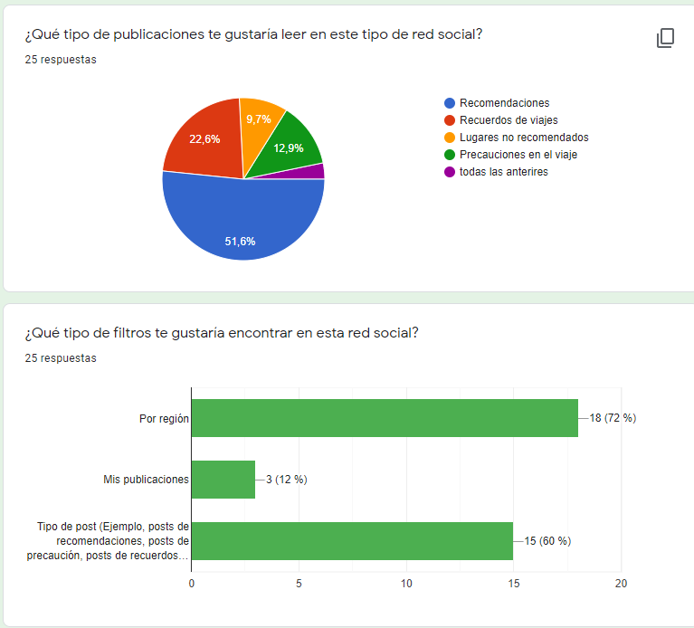
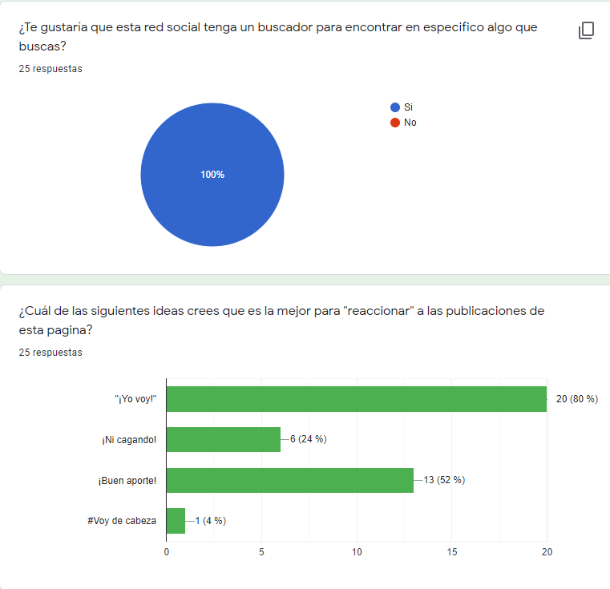
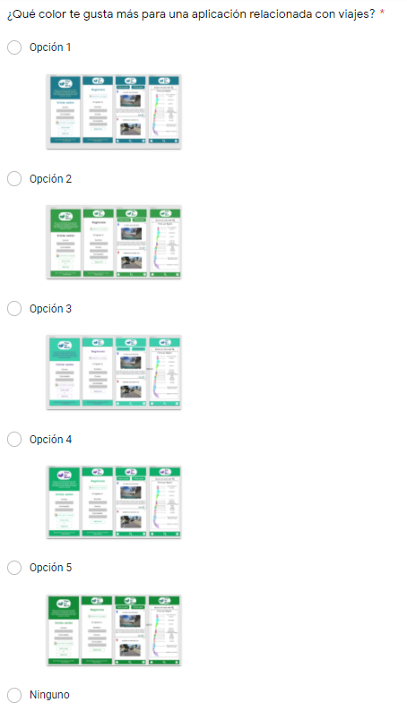
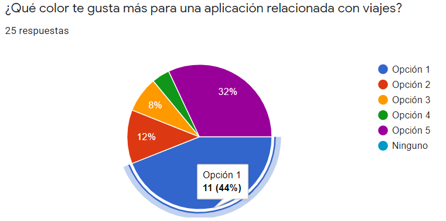
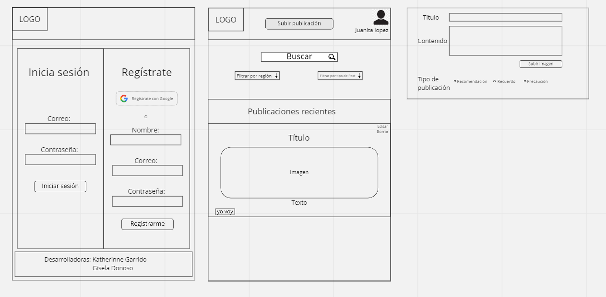
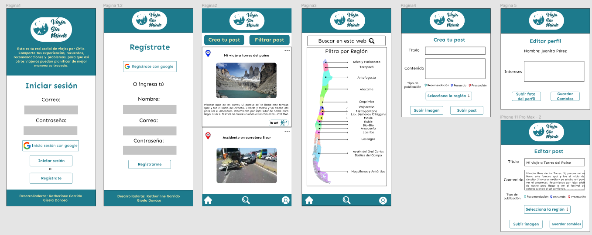

# Viaja sin miedo :sunrise_over_mountains: :ocean: :palm_tree:

Red Social asociada a viajes, donde puedes subir posts con recomendaciones, precauciones en el camino y recuerdos de lugares que has visitado. Con esta página lograrás encontrar otros viajeros que deseen recorrer lugares que ya conocen o desean conocer, puedes interactuar con ellos a través del botón _"yo voy"_, que indica que deseas ir al lugar que se ha posteado. _Creada por Katherinne Garrido y Gisela Donoso, generación 16 Laboratoria, Chile._

## 1. Público objetivo :bust_in_silhouette:
Personas que tengan las ganas de viajar, que tengan recuerdos de algún lugar que les haya gustado o quieran prever a otras personas sobre algún lugar en específico de Chile.

## 2.  Definición del producto :bar_chart:
Luego de identificar nuestro público objetivo, se realizó cuestionario para identificar cuales eran las necesidades específicas de nuestros usuarios. A continuación dejamos el resumen de los resultados arrojados.

Además se realizó encuesta para identificar el color adecuado para nuestra red social.

## 3. Historias de usuario :thought_balloon:

Se realizaron historias de usuarios a partir de la identificación de necesidades y/o problemas de nuestros posibles usuarios-viejeros:

* Yo como viajero por Chile quiero poder registrarme y logearme en la red social para poder tener una cuenta personalizada.

* Yo como viajero por Chile quiero poder subir publicaciones, poder editarlas y borrarlas.

* Yo como usuario de la red social quiero poder filtrar los post y además buscar en específico para poder acceder más rápido al post que deseo leer.

* Yo como usuario de la red social quiero poder personalizar mi perfil para poderme diferenciar al momento de realizar publicaciones.

* Yo como usuario de la red social quiero poder ver el muro solo cuando este mi sesión abierta y también deseo cerrar sesión para poder tener más seguridad de mis publicaciones.

## 3. Diseño de interfaz de usuario :round_pushpin:

### Prototipo de Baja fidelidad :pencil2:

### Prototipo de Alta fidelidad :black_nib:

## 4. Producto final